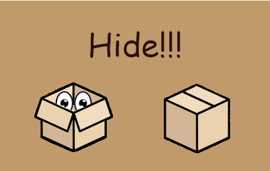

# Hide!!!
Hide!!! is a Chrome extension that allows you to hide your tabs in a pinch ;). Hide!!! allows you to use custom shortcuts both (a) to close all tabs, redirect to a new webpage, and clear your recent history and (b) to restore them as they were when you closed them. The default shortcuts are `Alt + P` to hide and `Alt + O` to restore.

## Installation
You can download it [here.](https://chrome.google.com/webstore/detail/hide/dppkgbgooinkbjemcpddmldmppgfngik?hl=en)

## Usage
1. After installation, press the extension icon to open settings. Change to your heart's desire.
2. If about to be caught, quickly press Alt + P (or your custom hotkey command) to immediately close all tabs and redirect to a new webpage (default is google.com).
3. When the coast is clear, press Alt + Q (or your custom hotkey command) to restore your tabs.
